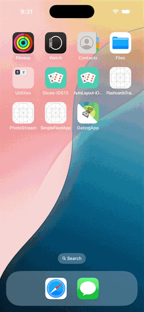

# PhotoStream
PhotoStream is an iOS application that allows users scroll through a stram photos fetched from a remote server. The app displays photos in a grid layout and supports infinite scrolling to load more photos as the user scrolls down. The app also allows users to tap on a photo to view it in full screen, and download the photo to their device.
## Features
- Fetch photos from a remote server and display them in a grid layout.
- Infinite scrolling to load more photos as the user scrolls down.
- Tap on a photo to view it in full screen.
- Download photos to the device.
## Installation
1. Clone the repository:
    ```bash
    git clone
    ```
2. Open the project in Xcode.
3. Build and run the application on a simulator or physical device.
## Usage
1. Scroll through the grid of photos to view them.
2. Tap on a photo to view it in full screen.
3. Tap the download button to save the photo to your device.
## Contributing
Contributions are welcome! Please fork the repository and create a pull request with your changes.
## License
This project is licensed under the MIT License. See the LICENSE file for details.
## UI Design
The user interface consists of the following components:
- A grid view displaying photos fetched from the remote server.
- Infinite scrolling functionality to load more photos as the user scrolls down.
- A full-screen view for displaying a selected photo.
- A download button to save the photo to the device.
- Clean and modern layout with a focus on user experience.


